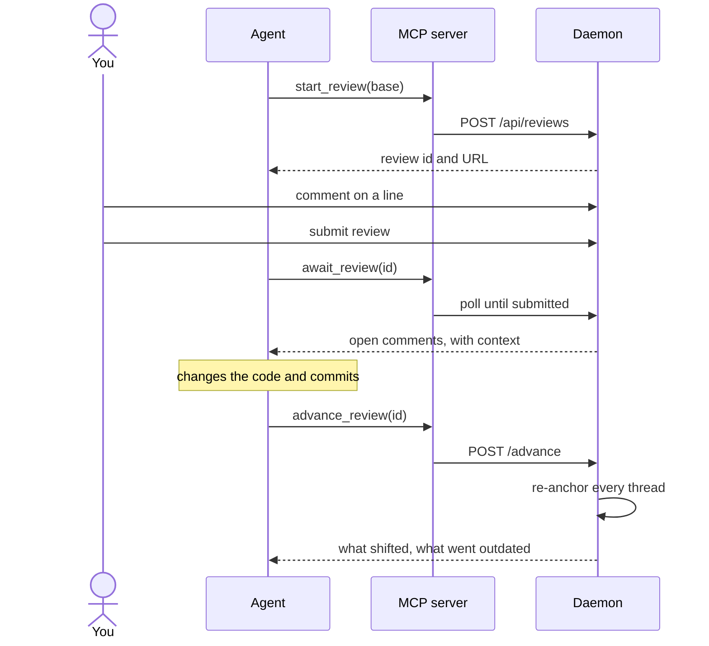
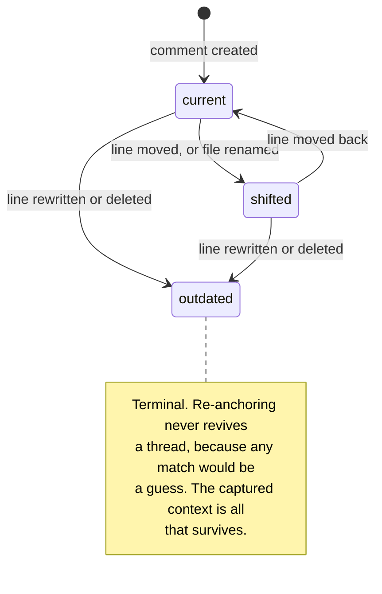

# yart

> **Y**et **A**nother **R**eview **T**ool

Local, GitHub-style code review for AI-generated diffs — inline comments loop back
to your agent over MCP.

## Why

Coding agents produce large diffs quickly. Reviewing them in terminal scrollback or
a flat `git diff` is painful: there is no file tree, no hunk navigation, and nowhere
to say "this line, specifically, is wrong."

Local diff viewers solve the reading half of that problem and then stop at a
**Copy prompt** button. yart closes the loop. Your comments travel back to the agent
as structured data over the Model Context Protocol, so the agent can act on them,
reply to them, and mark threads resolved — without anything being pushed to GitHub.

|                           | Copy-paste diff viewers | yart                            |
| ------------------------- | ----------------------- | ------------------------------- |
| Who starts the review     | You, manually           | The agent, via a tool call      |
| How comments travel       | Prose blob, pasted      | Structured `{file, line, side}` |
| Agent can reply / resolve | No                      | Yes                             |
| State across rounds       | None                    | Threads persist                 |

The last row is the point. Review is a _loop_ — change, review, comment, fix,
re-review showing only what is still open — and a clipboard has no memory.

## How it works


The daemon is a separate, long-lived process from the MCP server. MCP servers live
and die with their client, while a review has to outlast a session and be shared by
more than one agent at once — so the state belongs in a process neither client owns.
Both agents talk to the same daemon, and the first tool call starts one if none is
listening.

### The loop

Review is a loop rather than a single pass, which is the whole reason the anchoring
model exists:



## Status

Early — the scaffold is in place, the product is not.

- [x] pnpm workspace, React + TypeScript + Redux Toolkit
- [x] Design token foundation
- [x] Comment anchoring model
- [x] Review daemon: git adapter, thread storage, review rounds, HTTP API
- [x] MCP server
- [x] Review UI: diff rendering, inline comments, review rounds
- [x] Installable: `yart` and `yart-mcp` run from any repository
- [ ] Clipboard export (fallback for non-MCP agents)

## Getting started

Requires Node 20+ and pnpm.

Requires Node 20+ and pnpm.

```sh
pnpm install
pnpm build      # the daemon serves the built UI, so build it first
```

### Installing the commands

```sh
pnpm --filter @yart/daemon link --global
pnpm --filter @yart/mcp link --global
```

That puts `yart` and `yart-mcp` on your `PATH`, so any repository can be reviewed
by running `yart` inside it — no paths, no flags:

```sh
cd ~/some-other-project
yart            # http://localhost:7777
```

There is no build step for the commands themselves: their entry points are
TypeScript with a `#!/usr/bin/env -S node --experimental-strip-types` shebang, so
Node strips the types as it loads them.

Undo with `pnpm uninstall --global @yart/daemon @yart/mcp`.

### Running it

Open `http://localhost:7777`, or let an agent open a review for you with the
`start_review` tool. The daemon takes `--port` and `--repo`, and stores reviews
under `.git/yart/reviews/` so nothing appears in `git status`.

### Developing against yart's own diff

```sh
pnpm dev:actual
```

Starts the daemon and Vite, opens a review over whatever this branch changed
against its merge base with `main`, and prints the URL. Pass a revision to review
against something else.

It develops against a real diff rather than a fixture, because a fixture only
ever exercises the shapes it happens to contain — the repository's own history
supplies renames, deletions, binary files and long hunks for free. Re-running on
the same branch advances the existing review instead of opening another, so
comments left earlier follow your new commits and the re-anchoring is exercised
every time you iterate.

A daemon that is already listening is reused rather than replaced.

For UI work without a review, `pnpm dev` runs Vite alone on 5173 with `/api`
proxied to the daemon on 7777.

Other scripts:

```sh
pnpm build      # typecheck, then production build
pnpm typecheck  # types only
pnpm lint       # ESLint, including the naming conventions
pnpm format     # Prettier
pnpm test       # unit tests
```

## Project layout

```
apps/
  web/              React UI
    src/
      app/          Redux store and typed hooks
      features/     Feature slices and components
      styles/       Design tokens and reset
packages/
  core/             Domain model — anchoring, threads (no I/O)
  daemon/           Git adapter, review store, HTTP API, CLI
  mcp/              MCP server — the agent's side of the loop
```

## Comment anchoring

Review is a loop, so a comment has to survive the code changing underneath it.
The model that makes that possible lives in `packages/core`.

A comment anchors to **`(blob_sha, line)`**, not `(path, line)`. Paths move and
line numbers shift, but a git blob's content is immutable, so a blob hash plus a
line number always denotes the same text. Each thread keeps three things:

- `origin` — where it was created. Immutable, the audit record.
- `context` — the commented line plus its neighbours, captured at creation. The
  only thing that survives if the anchor dies.
- `anchor` — where it points now, or `null` once the line is gone.

When the agent pushes a new revision, every thread is re-anchored against it and
lands in one of three states:

| State      | Meaning                                              |
| ---------- | ---------------------------------------------------- |
| `current`  | Same file, same line as at creation                  |
| `shifted`  | The line survives, but moved or the file was renamed |
| `outdated` | The line is gone; only `context` remains             |

State is _derived_ from `origin` versus `anchor` on every pass rather than
accumulated, so a bug in one round cannot poison later ones.



Two deliberate judgment calls:

- **A rewritten line outdates its thread.** A line diff reports a modification
  as a deletion plus an insertion, so the anchor does not survive. This is
  correct — the comment referred to text that no longer exists — and doubles as
  a useful "the agent probably addressed this" signal.
- **Whitespace-only changes do not.** Line mapping ignores leading and trailing
  whitespace by default, because agents reformat constantly and a reindent that
  outdated every thread in a file would make review unusable. Set
  `ignore_whitespace: false` to opt out.

`reanchorThread` takes the line mapping as an _input_ rather than computing it,
so the model is a pure lookup and does not care where the diff came from. A
mapping can be built from text with `buildLineMap` (which uses
[`diff`](https://github.com/kpdecker/jsdiff)), or later from `git diff` output —
swapping one for the other does not touch the anchoring logic.

## Conventions

Naming is a project requirement rather than a preference, and is enforced by
ESLint: variables and properties are `snake_case`, functions are `camelCase`,
types are `PascalCase`, constants are `UPPER_SNAKE_CASE`, and files and
directories are `kebab-case`. Callables are const arrows rather than `function`
declarations, and Prettier owns formatting (no semicolons, single quotes, 100
columns). Properties stay
`snake_case` on serialized types too, so the JSON that travels over MCP matches
the source. The full rules and their exceptions are in
[`AGENTS.md`](AGENTS.md).

## The daemon

`packages/daemon` is the long-lived process the UI and the MCP server both talk
to. It is deliberately separate from the MCP server: MCP servers live and die
with their client, while a review has to outlast a session and be shared by more
than one agent at once.

It owns three things.

**A git adapter.** Revision ranges, changed files with the blob on each side,
rename detection, and blob contents. It also builds line maps from `git diff
--unified=0`, reading only hunk headers: everything outside a hunk is unchanged
and maps across with a running offset, everything inside is replaced and maps
nowhere. Using git rather than diffing text in process is faster and, more
importantly, means the tool that produced the blob hashes is the one comparing
them, so two implementations cannot disagree about what changed.

**Review state**, persisted as JSON under `.git/yart/reviews/`. Per-repository,
invisible to `git status`, and in a directory yart will never be asked to show.

**An HTTP API.**

| Route                                         | Purpose                             |
| --------------------------------------------- | ----------------------------------- |
| `POST /api/reviews`                           | Open a review over a range          |
| `GET /api/reviews` · `GET /api/reviews/:id`   | List, or fetch one                  |
| `GET /api/reviews/:id/file?path=`             | Both sides of a file, for rendering |
| `POST /api/reviews/:id/threads`               | Comment on a line                   |
| `POST /api/reviews/:id/threads/:tid/comments` | Reply in a thread                   |
| `PATCH /api/reviews/:id/threads/:tid`         | Open or resolve a thread            |
| `POST /api/reviews/:id/submit`                | Hand the review back                |
| `POST /api/reviews/:id/advance`               | Move to a new head, re-anchoring    |

`advance` is where the loop closes: it diffs the old head against the new one,
builds a line map per changed file, and re-anchors every thread, so the next
round shows what is still open rather than starting over.

## The review UI

`apps/web` is what a human actually uses. The daemon serves it, so there is one
address for both the API and the pages, and a deep link to a review works
because unknown paths fall back to `index.html`.

The diff is rendered unified, with a gutter per side: a line has a number in the
base, in the head, or in both, and a comment attaches to whichever side the row
actually exists on — a removed line is addressed in the base, an added or
context line in the head. Hovering a row reveals a control to comment on it, and
threads open inline beneath the line they belong to.

**Hunks come from the daemon, not from diffing in the browser.** The temptation
is to send both file contents and diff them client-side, but then the rendered
diff and the anchors are computed by two different implementations, and when
they disagree a comment lands on the wrong line. The daemon parses `git diff`
and sends hunks with a line number already on each side.

Comments whose line no longer exists cannot sit anywhere in the diff, so the
file header lists them instead, above the hunks, with the text they were written
against. They are the record of a conversation and dropping them would be worse
than showing them out of place.

## The MCP server

`packages/mcp` is how an agent drives a review. It is a shim: it holds no state
and makes no decisions, it translates MCP tool calls into daemon HTTP requests.

The first tool call starts a daemon if none is listening, so an agent does not
have to ask anyone to run one first. The daemon is spawned detached, because an
MCP server dies with its client and a review has to outlive that.

| Tool              | What the agent does with it                                 |
| ----------------- | ----------------------------------------------------------- |
| `start_review`    | Open a review after making changes; returns an id and a URL |
| `await_review`    | Block until the human submits, then read their comments     |
| `get_review`      | Read current state without blocking                         |
| `list_reviews`    | List reviews in this repository                             |
| `reply_to_thread` | Explain a change, or push back on a comment                 |
| `resolve_thread`  | Mark a comment addressed                                    |
| `advance_review`  | Re-anchor every comment onto new commits                    |

Comments come back rendered as text rather than JSON, because the consumer is a
model deciding what to edit and a comment is easier to act on next to the code
it points at:

```
[ce53cb3a-…] a.txt:3  (moved from a.txt:2)
      alpha
  >   TARGET
      gamma
  human: this name is unclear
  agent: renamed it
```

`await_review` returns instead of hanging when its timeout passes, handing back
whatever has been written so far — a timeout is not a failure, and the agent can
simply call it again.

### Registering it

With Claude Code, from the repository you want to review:

```sh
claude mcp add yart -- yart-mcp
```

With Claude Desktop, add to its MCP configuration:

```json
{
  "mcpServers": {
    "yart": {
      "command": "yart-mcp",
      "args": ["--repo", "/absolute/path/to/the/repository"]
    }
  }
}
```

Both connect to the same daemon, which is the point of keeping it a separate
process.

## Design system

yart does not use a component library. Every value the UI renders resolves to a
token in [`apps/web/src/styles/tokens.css`](apps/web/src/styles/tokens.css), and
components are styled with CSS Modules referencing those tokens rather than raw
literals. The palette is deliberately warm — ink on paper — instead of the cool
slate-and-blue that most developer tooling defaults to.

## License

MIT © Jens Karlsson
