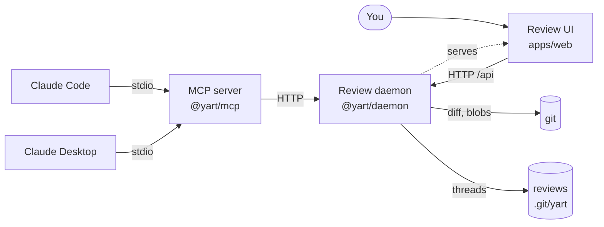
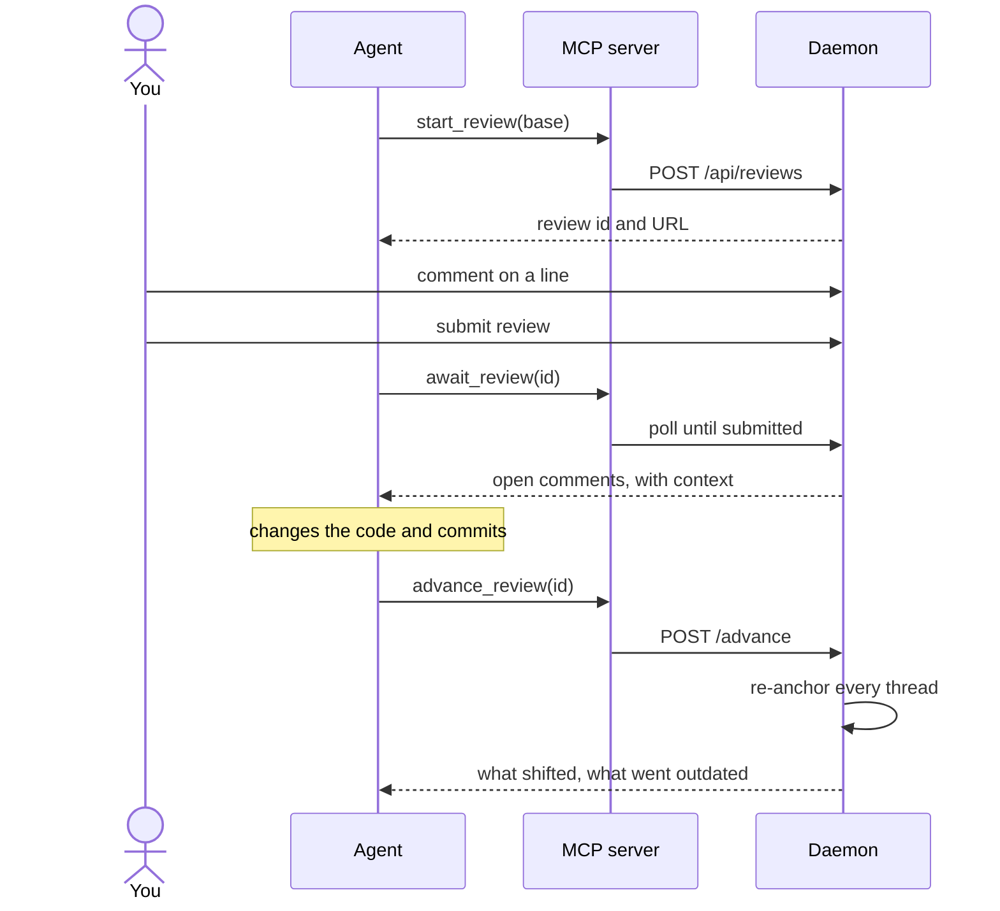
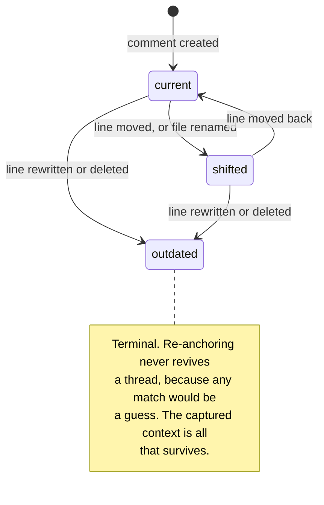

# yart

> **Y**et **A**nother **R**eview **T**ool

Local, GitHub-style code review for AI-generated diffs — inline comments loop back
to your agent over MCP.

## Why

Coding agents produce large diffs quickly. Reviewing them in terminal scrollback or
a flat `git diff` is painful: there is no file tree, no hunk navigation, and nowhere
to say "this line, specifically, is wrong."

Local diff viewers solve the reading half of that problem and then stop at a
**Copy prompt** button. yart closes the loop. Your comments travel back to the agent
as structured data over the Model Context Protocol, so the agent can act on them,
reply to them, and mark threads resolved — without anything being pushed to GitHub.

|                           | Copy-paste diff viewers | yart                            |
| ------------------------- | ----------------------- | ------------------------------- |
| Who starts the review     | You, manually           | The agent, via a tool call      |
| How comments travel       | Prose blob, pasted      | Structured `{file, line, side}` |
| Agent can reply / resolve | No                      | Yes                             |
| State across rounds       | None                    | Threads persist                 |

The last row is the point. Review is a _loop_ — change, review, comment, fix,
re-review showing only what is still open — and a clipboard has no memory.

## How it works



The daemon is a separate, long-lived process from the MCP server. MCP servers live
and die with their client, while a review has to outlast a session and be shared by
more than one agent at once — so the state belongs in a process neither client owns.
Both agents talk to the same daemon, and the first tool call starts one if none is
listening.

### The loop

Review is a loop rather than a single pass, which is the whole reason the anchoring
model exists:



## Status

Early — the scaffold is in place, the product is not.

- [x] pnpm workspace, React + TypeScript + Redux Toolkit
- [x] Design token foundation
- [x] Comment anchoring model
- [x] Review daemon: git adapter, thread storage, review rounds, HTTP API
- [x] MCP server
- [x] Review UI: diff rendering, inline comments, review rounds
- [x] Review UI: file tree, collapsed context expandable in place
- [x] Replying to a verdict, and a signal for how far the agent has got
- [x] A tab-title and favicon signal when the agent has answered
- [x] Pending reviews, a Reviewed mark per file, and folding in the file tree
- [x] Installable: `yart` and `yart-mcp` run from any repository
- [ ] Clipboard export (fallback for non-MCP agents)

## Getting started

Requires Node 20+ and pnpm.

Requires Node 20+ and pnpm.

```sh
pnpm install
pnpm build      # the daemon serves the built UI, so build it first
```

### Installing the commands

```sh
pnpm --filter @yart/daemon link --global
pnpm --filter @yart/mcp link --global
```

That puts `yart` and `yart-mcp` on your `PATH`, so any repository can be reviewed
by running `yart` inside it — no paths, no flags:

```sh
cd ~/some-other-project
yart            # http://localhost:7777
```

There is no build step for the commands themselves: their entry points are
TypeScript with a `#!/usr/bin/env -S node --experimental-strip-types` shebang, so
Node strips the types as it loads them.

Undo with `pnpm uninstall --global @yart/daemon @yart/mcp`.

### Running it

Open `http://localhost:7777`, or let an agent open a review for you with the
`start_review` tool. The daemon takes `--port` and `--repo`, and stores reviews
under the repository's git directory so nothing appears in `git status`. Linked
worktrees share one store, so a review opened in any worktree is visible from
all of them and records which one it belongs to.

### Developing against yart's own diff

```sh
pnpm dev:actual
```

Starts the daemon and Vite, opens a review over whatever this branch changed
against its merge base with `main`, and prints the URL. Pass a revision to review
against something else.

It develops against a real diff rather than a fixture, because a fixture only
ever exercises the shapes it happens to contain — the repository's own history
supplies renames, deletions, binary files and long hunks for free. Re-running on
the same branch advances the existing review instead of opening another, so
comments left earlier follow your new commits and the re-anchoring is exercised
every time you iterate.

A daemon that is already listening is reused rather than replaced.

For UI work without a review, `pnpm dev` runs Vite alone on 5173 with `/api`
proxied to the daemon on 7777.

Other scripts:

```sh
pnpm build      # typecheck, then production build
pnpm typecheck  # types only
pnpm lint       # ESLint, including the naming conventions
pnpm format     # Prettier
pnpm test       # unit tests
```

## Project layout

```
apps/
  web/              React UI
    src/
      app/          Redux store and typed hooks
      features/     Feature slices and components
      styles/       Design tokens and reset
packages/
  core/             Domain model — anchoring, threads (no I/O)
  daemon/           Git adapter, review store, HTTP API, CLI
  mcp/              MCP server — the agent's side of the loop
```

## Comment anchoring

Review is a loop, so a comment has to survive the code changing underneath it.
The model that makes that possible lives in `packages/core`.

A comment anchors to **`(blob_sha, line)`**, not `(path, line)`. Paths move and
line numbers shift, but a git blob's content is immutable, so a blob hash plus a
line number always denotes the same text. Each thread keeps three things:

- `origin` — where it was created. Immutable, the audit record.
- `context` — the commented line plus its neighbours, captured at creation. The
  only thing that survives if the anchor dies.
- `anchor` — where it points now, or `null` once the line is gone.

When the agent pushes a new revision, every thread is re-anchored against it and
lands in one of three states:

| State      | Meaning                                              |
| ---------- | ---------------------------------------------------- |
| `current`  | Same file, same line as at creation                  |
| `shifted`  | The line survives, but moved or the file was renamed |
| `outdated` | The line is gone; only `context` remains             |

State is _derived_ from `origin` versus `anchor` on every pass rather than
accumulated, so a bug in one round cannot poison later ones.



Two deliberate judgment calls:

- **A rewritten line outdates its thread.** A line diff reports a modification
  as a deletion plus an insertion, so the anchor does not survive. This is
  correct — the comment referred to text that no longer exists — and doubles as
  a useful "the agent probably addressed this" signal.
- **Whitespace-only changes do not.** Line mapping ignores leading and trailing
  whitespace by default, because agents reformat constantly and a reindent that
  outdated every thread in a file would make review unusable. Set
  `ignore_whitespace: false` to opt out.

`reanchorThread` takes the line mapping as an _input_ rather than computing it,
so the model is a pure lookup and does not care where the diff came from. A
mapping can be built from text with `buildLineMap` (which uses
[`diff`](https://github.com/kpdecker/jsdiff)), or later from `git diff` output —
swapping one for the other does not touch the anchoring logic.

## Conventions

Naming is a project requirement rather than a preference, and is enforced by
ESLint: variables and properties are `snake_case`, functions are `camelCase`,
types are `PascalCase`, constants are `UPPER_SNAKE_CASE`, and files and
directories are `kebab-case`. Callables are const arrows rather than `function`
declarations, and Prettier owns formatting (no semicolons, single quotes, 100
columns). Properties stay
`snake_case` on serialized types too, so the JSON that travels over MCP matches
the source. The full rules and their exceptions are in
[`AGENTS.md`](AGENTS.md).

## The daemon

`packages/daemon` is the long-lived process the UI and the MCP server both talk
to. It is deliberately separate from the MCP server: MCP servers live and die
with their client, while a review has to outlast a session and be shared by more
than one agent at once.

**One daemon serves every repository.** A request that opens a review names the
repository it is for, and the MCP server sends the one it was started in. It
used to be otherwise — a daemon was fixed to the repository it started in, and
every client reused whichever daemon was listening, so an agent in one project
could be handed a review of another's working tree without any error. The
daemon keeps one service per repository, keyed by the shared git directory so
that a repository's worktrees share one list, and remembers the repositories it
has served in `~/.yart` (or `YART_HOME`) so that a review in any of them can be
found by id after a restart. A request that names no repository gets the one
the daemon was started in, which keeps an agent on an older yart working.

After an update, the daemon still running is the old one. The MCP server checks
`/health`, which now carries a version, and refuses an older daemon that serves
a different repository, with a message saying to stop it, rather than review
the wrong one.

**Writes must be JSON.** A web page on any site can send a "simple" cross-origin
POST to `localhost` without the browser asking first, and although it cannot
read the answer, the daemon would still act on it — in any repository a page
could name. Requiring `application/json` on every POST and PATCH makes such a
request one a browser must ask permission for, and the daemon never grants it.

It owns three things.

**A git adapter.** Revision ranges, changed files with the blob on each side,
rename detection, and blob contents. It also builds line maps from `git diff
--unified=0`, reading only hunk headers: everything outside a hunk is unchanged
and maps across with a running offset, everything inside is replaced and maps
nowhere. Using git rather than diffing text in process is faster and, more
importantly, means the tool that produced the blob hashes is the one comparing
them, so two implementations cannot disagree about what changed.

**Review state**, persisted as JSON under `.git/yart/reviews/`. Per-repository,
invisible to `git status`, and in a directory yart will never be asked to show.

**An HTTP API.**

| Route                                         | Purpose                             |
| --------------------------------------------- | ----------------------------------- |
| `POST /api/reviews`                           | Open a review in a named repository |
| `GET /api/reviews` · `GET /api/reviews/:id`   | List, or fetch one                  |
| `GET /api/reviews/:id/file?path=`             | Both sides of a file, for rendering |
| `POST /api/reviews/:id/threads`               | Comment on a line                   |
| `POST /api/reviews/:id/threads/:tid/comments` | Reply in a thread                   |
| `PATCH /api/reviews/:id/threads/:tid`         | Open or resolve a thread            |
| `POST /api/reviews/:id/submit`                | Hand the review back                |
| `POST /api/reviews/:id/advance`               | Move to a new head, re-anchoring    |

`advance` is where the loop closes: it diffs the old head against the new one,
builds a line map per changed file, and re-anchors every thread, so the next
round shows what is still open rather than starting over.

## The review UI

`apps/web` is what a human actually uses. The daemon serves it, so there is one
address for both the API and the pages, and a deep link to a review works
because unknown paths fall back to `index.html`.

The diff is rendered unified, with a gutter per side: a line has a number in the
base, in the head, or in both, and a comment attaches to whichever side the row
actually exists on — a removed line is addressed in the base, an added or
context line in the head. Hovering a row reveals a control to comment on it, and
threads open inline beneath the line they belong to.

**Hunks come from the daemon, not from diffing in the browser.** The temptation
is to send both file contents and diff them client-side, but then the rendered
diff and the anchors are computed by two different implementations, and when
they disagree a comment lands on the wrong line. The daemon parses `git diff`
and sends hunks with a line number already on each side.

Comments whose line no longer exists cannot sit anywhere in the diff, so the
file header lists them instead, above the hunks, with the text they were written
against. They are the record of a conversation and dropping them would be worse
than showing them out of place.

A sidebar lists the changed files as a tree, folding directory chains that hold
nothing but one child, with each file's added and removed totals and a count of
the threads still open on it. Clicking one brings it into view, and the file
being read is marked as you scroll, measured from the sections themselves so
that opening a run of context mid-page cannot put the mark out of step. Paths
are not safe as URL fragments, so the tree scrolls rather than links.

**Unchanged lines are recovered from the head blob, not from a wider diff.**
git describes only what changed, so everything between two hunks is absent from
the diff entirely. Rather than asking git for more context than anyone will
read, each run of hidden lines is drawn as a band where the `@@` header used to
be — carrying the enclosing function git named for the hunk below — and opening
one fetches the file's full text once and slices the lines out of it. Twenty at
a time from either end, or all of them when few enough remain. A line revealed
this way is an ordinary row and can be commented on like any other. Knowing
whether a file continues past its last hunk takes the file's length, which is
why the diff carries `head_line_count`.

## Drafting a review

A review is drafted, not dictated: a comment written on file 3 is often
withdrawn by the time file 20 explains it. So each comment form offers two
actions, as on GitHub. **Start a review** (or **Add to review** once one has
started) holds the comment; **Comment now** sends it on its own. Holding is the
primary action and the one Cmd+Enter takes, because it is the common case.

Held comments are drawn in place as Pending, and can be edited or dropped. They
live in the browser, per person and per device, and never reach the daemon
until the review is submitted — so an agent calling `get_review` cannot see a
comment its author has not sent. Submitting sends them all with the verdict in
one request, and the daemon writes them in one go or not at all: half a review,
some comments posted and the verdict not, would leave the agent reading
something its author had not finished.

**A held line comment is tied to its file, not to the review.** Its line number
was counted in one version of one file, so it records that file's blob and stays
good through any number of rounds that leave the file alone. If the file does
change, the comment is shown as stale in the submit panel, kept out of the diff,
and has to be dropped before submitting — drawing it at its old line number
would put it beside code it was never about. Replies are never stale, because
threads are re-anchored when a review moves. The daemon checks the same thing,
and also refuses a submission made against a head that is no longer current,
since a verdict passed on it says nothing about code the reviewer has not seen.

## Marking files reviewed

Each file has a **Reviewed** checkbox. Ticking it collapses the file and marks it
in the tree, whose header counts how many are done. File headers stick to the
top of the window, so the box is in reach at the end of a long file, where the
decision is made. A file can also be collapsed by hand without being reviewed.

**A reviewed mark is kept against the file's blob,** so if the agent changes the
file afterwards it stops counting as reviewed on its own and opens up again. A
tick that outlived the code it was given for would say something untrue.

Directories in the tree fold away too, and a folded directory keeps the added,
removed and open-thread counts of everything it hides. Folding a directory does
not hide its diffs: the tree is an index, not a filter.

## Answering a verdict

A verdict is the one thing in a review that used to have nothing to say back to
it. Line comments have threads; a summary left with `approved` or
`changes_requested` was write-only, so an agent that had already done the thing
being asked for, or disagreed with it, had to answer in whatever chat window it
happened to be in — which is the conversation leaving the tool.

A submission now carries its own comments. It is not anchored to a line, so this
is a plain list rather than a `Thread`, and it is addressed by submission id
rather than always landing on the latest: a review that has been round several
times has several verdicts, and a reply belongs to the one it answers.

## Knowing when to look again

Once a review is handed back, the question is not whether the agent is working
but whether it has finished. yart reports three states, derived rather than
stored:

| State         | What it means                                                    |
| ------------- | ---------------------------------------------------------------- |
| `idle`        | Nothing has happened since the verdict                           |
| `in_progress` | Answers or changes have appeared, but comments are still waiting |
| `ready`       | Nothing is waiting on the agent; worth opening again             |

A thread counts as answered when the agent spoke last, or when it was resolved.
Turning on who spoke last matters: a human replying to the agent's answer puts
the thread back in the agent's court, and a count that did not notice would
report the same work as finished twice.

`ready` deliberately does not require the code to have changed. An agent that
answers every comment by explaining why it disagrees has finished its turn just
as much as one that rewrote the file, and both need a person to look. Changes
with nothing answered are `in_progress`, not `ready` — moving the code is not an
invitation to re-read it while the questions are still open.

In the list this is one label, not two. The verdict and the agent's progress are
the same fact read at different moments — a verdict is given, then the agent
responds to it — so a review reads `open`, then its verdict, then `agent working`,
then `your turn`. Once the agent has moved, whose turn it is matters more than
what you decided, and the verdict is at the top of the page you are about to
open. How many comments have been answered is in the label's tooltip.

The unseen dot below answers a different question and does not replace this.
The dot means something is new since you looked; the label means whose turn it
is. They come apart when the agent has answered one comment of three — new, but
not yet your turn — and when you have glanced at a finished review and moved on,
which clears the dot but leaves the review waiting on you.

## Noticing that the agent has answered

The point of a local review tool is to work on something else while the agent
responds, and that only pays if you find out when it has. The list shows a dot
on a review that has moved since you last looked, the tab title carries a count,
and the favicon grows a dot — both of the last two because neither is enough
alone: a pinned tab shows no title, and a tab among twenty shows a favicon too
small to read a number on.

**Seen-ness is per person and per device, so it lives in the browser** and never
reaches the daemon. That also means an agent cannot mark its own work as read.
Storage can be absent or throw in a private window, so a failure degrades to
showing no dot rather than to a blank page.

**What is compared is not a timestamp.** `updated_at` moves when anyone touches
a review, so writing a comment would mark the review unread to the person who
wrote it. `agentActivity` counts what the agent has said and done — replies,
resolves and rounds — as one number that only grows, and a review is unseen when
that number is larger than it was when you last had the review open. Counting
rather than hashing means a stale marker can only under-report: the worst case
is a missed dot, never a dot that will not clear.

A review you have never opened shows no dot. There is no "since" to measure
from, and a list where everything shouts says nothing.

**The list is polled rather than refetched on focus.** The rest of the app
refetches when the window regains focus, which cannot deliver this signal: a
page nobody is looking at never regains focus. Ten seconds against a daemon on
localhost costs nothing, and browsers throttle timers in hidden tabs anyway,
which is exactly the case this is for.

## Reviewing uncommitted work

A review does not need a commit. By default `start_review` reviews the working
tree as it stands, including files git is not yet tracking, which is the state
an agent is in the moment it finishes and says it is ready.

That works by writing the working tree into a git tree object through a
throwaway index, so the caller's staging area is untouched, and pinning it under
`refs/yart/reviews/<id>`. Every file then has a real blob hash for comments to
anchor to, garbage collection cannot reap it, and the snapshot is immutable — so
comments stay where they were put while the files underneath keep changing.

Advancing such a review takes a new snapshot rather than a newer revision, so
the whole loop runs without anything being committed: comment, edit, advance,
and the comments follow their lines or go outdated.

## The MCP server

`packages/mcp` is how an agent drives a review. It is a shim: it holds no state
and makes no decisions, it translates MCP tool calls into daemon HTTP requests.

The first tool call starts a daemon if none is listening, so an agent does not
have to ask anyone to run one first. The daemon is spawned detached, because an
MCP server dies with its client and a review has to outlive that.

| Tool               | What the agent does with it                                 |
| ------------------ | ----------------------------------------------------------- |
| `start_review`     | Open a review after making changes; returns an id and a URL |
| `await_review`     | Block until the human submits, then read their comments     |
| `get_review`       | Read current state without blocking                         |
| `list_reviews`     | List reviews in this repository                             |
| `reply_to_thread`  | Explain a change, or push back on a comment                 |
| `reply_to_verdict` | Answer the summary left with the verdict                    |
| `resolve_thread`   | Mark a comment addressed                                    |
| `advance_review`   | Re-anchor every comment onto new commits                    |

**A new review opens in your browser.** The one step of the loop that needs a
person is the person looking, and relying on an agent to relay a URL is how that
step gets skipped — it did, repeatedly, before this existed. An empty review
opens nothing, since there would be nothing to read. Set `YART_NO_BROWSER=1`
where a window would be wrong: a container, a remote shell, or a second screen
you did not ask to have taken over.

Comments come back rendered as text rather than JSON, because the consumer is a
model deciding what to edit and a comment is easier to act on next to the code
it points at:

```
[ce53cb3a-…] a.txt:3  (moved from a.txt:2)
      alpha
  >   TARGET
      gamma
  human: this name is unclear
  agent: renamed it
```

`await_review` returns instead of hanging when its timeout passes, handing back
whatever has been written so far — a timeout is not a failure, and the agent can
simply call it again.

### Registering it

With Claude Code, from the repository you want to review:

```sh
claude mcp add yart -- yart-mcp
```

With Claude Desktop, add to its MCP configuration:

```json
{
  "mcpServers": {
    "yart": {
      "command": "yart-mcp",
      "args": ["--repo", "/absolute/path/to/the/repository"]
    }
  }
}
```

Both connect to the same daemon, which is the point of keeping it a separate
process.

## Design system

yart does not use a component library. Every value the UI renders resolves to a
token in [`apps/web/src/styles/tokens.css`](apps/web/src/styles/tokens.css), and
components are styled with CSS Modules referencing those tokens rather than raw
literals. The palette is deliberately warm — ink on paper — instead of the cool
slate-and-blue that most developer tooling defaults to.

## License

MIT © Jens Karlsson
